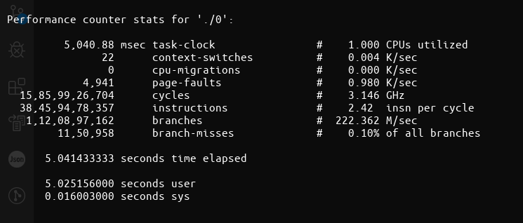
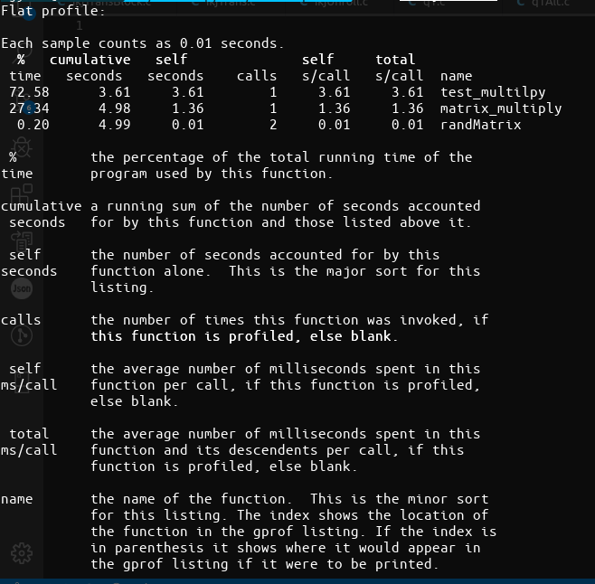
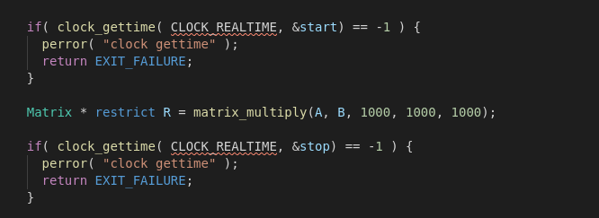
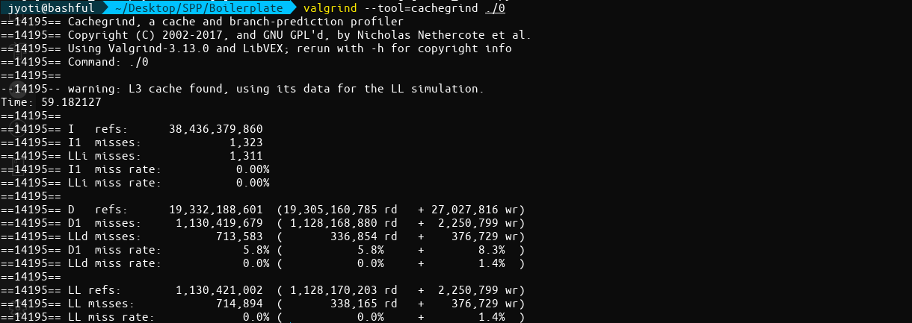
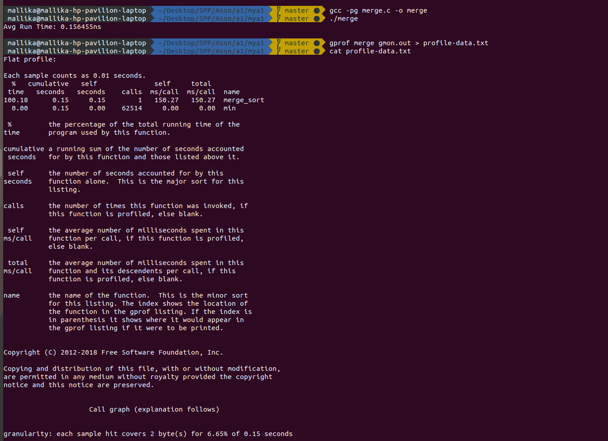
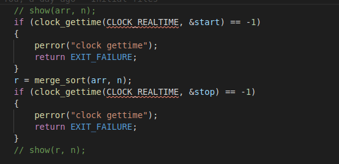
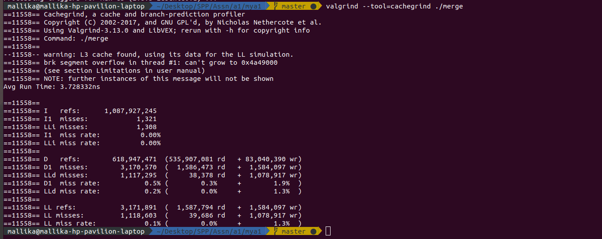

# Churu-Darth-Romance

## Objective

> Optimising code for matrix multiplication and merge sort, as well as gaining understanding of optimization methods and tools.

## Task 0

Gain an understanding of `​perf`, `cachegrind`, `gprof` and `clock_gettime​`.

>## 1. `perf`

`perf` is a performance counter tool for Linux that provides a framework for all things for performance analysis. It covers harware level (CPU/PMU) features as well as software features such as software counters, tracepoints.

Makes use of data from the Performance Monitoring Unit (PMU) in CPUs.

## Installation (On Linux)

```bash
$uname -r       ```5.0.0-37-generic```
$sudo apt install linux-tools-5.0.0-37-generic
```

Use the first command to obtain the kernel release, and fill it in the second command.

## Common subcommands

>### `stat`

Used to run a command and obtain performance counter statistics on it.

For example `perf stat ls` gives us:
~ Add image here ~

>### `record`

Used to run a command and gather a performance counter profile from it that is stored into perf.data file without displaying anything. 

>### `report`

Used to read the perf.data file present in the directory and display the performance profile onto the terminal.

>### `list`

Used to list all the symbolic even types analysed by the `perf` command such as cache misses, context swiitches, L1-dcache-loads and so on.

>### `trace`

Used to show the events associated with the target,initially syscalls, but other system events like pagefaults, task lifetime events, scheduling events and so on.

## Common options

>### `-a`

Used to obtain a system wide performance analysis from all CPUs

>### `-e`

Used to show only data/ performance with respect to specific syscalls or events like context switches.

Used as `perf stat -e cs ls` to obtain context switch data about `ls`.

>### `-p`

Used to record events and analyse performance by supplying PIDs of the processes in a comma seperated list.

>### `-t`

Used to record events and analyse performance on existing thread IDs.

>### `-d`

Used to provide a ,more detailed performance analysis, consisting of time taken per event and so on.

>## 2. `cachegrind`

`cachegrind` simulates how your program interacts with a machine's cache hierarchy and (optionally) branch predictor. It simulates a machine with independent first-level instruction and data caches (I1 and D1), backed by a unified second-level cache (L2). This exactly matches the configuration of many modern machines.

However, some modern machines have three or four levels of cache. For these machines (in the cases where `cachegrind` can auto-detect the cache configuration) it simulates the first-level and last-level caches. The reason for this choice is that the last-level cache has the most influence on runtime, as it masks accesses to main memory. Furthermore, the L1 caches often have low associativity, so simulating them can detect cases where the code interacts badly with this cache.

Therefore, `cachegrind` is a tool for doing cache simulations and annotating your source line-by-line with the number of cache misses. In particular, it records:

* L1 instruction cache reads and misses (I1)
* L1 data cache reads and read misses, writes and write misses (D1)
* L2 unified cache reads and read misses, writes and writes misses (LL)

## Usage

```bash
$valgrind --tool=cachegrind <program>
```

 Cachegrind will slowly excecute the program and print summary cache statistics. It also collects line-by-line information in a file `cachegrind.out.pid`, where `pid` is the program's process id.

 ```bash
$cg_annotate <filename>
```

The above is done to generate a function-by-function summary, and possibly annotate source files.

```bash
$cg_merge -o outputfile <file1> <file2> <file3> ...
```

The above is done to read multiple profile files, as created by Cachegrind, merges them together, and writes the results into another file in the same format.

 The merging functionality might be useful if you want to aggregate costs over multiple runs of the same program, or from a single parallel run with multiple instances of the same program.

 ```bash
 cg_diff file1 file2
 ```

 cg_diff is a simple program which reads two profile files, as created by Cachegrind, finds the difference between them, and writes the results into another file in the same format.

## Common Options

>### `--<cachename>=<size>,<associativity>,<line size>`

 Here `<cachename>` can be I1, D1 or L1 and this options is used to specify the size, associativity and line size of the cache level.

>### `--cache-sim=no|yes [yes]`

Enables or disables collection of cache access and miss counts.

>### `-branch-sim=no|yes [no] `

Enables or disables collection of branch instruction and misprediction counts.By default this is disabled as it slows Cachegrind down by approximately 25%.

>### `--cachegrind-out-file=<file>`

Write the profile data to `file` rather than to the default output file, `cachegrind.out.pid`

>## 3. `clock_gettime()`

POSIX is a standard for implementing and representing time sources. In contrast to the hardware clock, which is selected by the kernel and implemented across the system; the POSIX clock can be selected by each application, without affecting other applications in the system.

`clock_gettime()` is a function used to read a given POSIX clock and is defined at <time.h>.
The clock_gettime() command takes two parameters: the POSIX clock ID and a timespec structure which will be filled with the duration used to read the clock. The following example shows the function to measure the cost of reading the clock: 

```c
#include <time.h>

main()
{
    int rc;
    long i;
    struct timespec ts;

    for(i=0; i<10000000; i++) {
        rc = clock_gettime(CLOCK_MONOTONIC, &ts);
    }
}
```

## Usage 

```c
int clock_gettime(clockid_t clk_id, struct timespec *tp);
```

The functions clock_gettime() and clock_settime() retrieve and set the time of the specified clock clk_id.
The res and tp arguments are timespec structs, as specified in <time.h>:

```c
struct timespec {
        time_t   tv_sec;        /* seconds */
        long     tv_nsec;       /* nanoseconds */
};
```

The clk_id argument is the identifier of the particular clock on which to act. A clock may be system-wide and hence visible for all processes, or per-process if it measures time only within a single process.

The programs using the clock_gettime() function must be linked with the rt library by adding '-lrt' to the gcc command line

```bash
$gcc clock_timing.c -o clock_timing -lrt
```

## Return Value

clock_gettime() returns a 0 for success, or -1 for failure (in which case errno is set appropriately).

## Supported Clock Types

Sufficiently recent versions of glibc and the Linux kernel support the following clocks:

#### CLOCK_REALTIME

System-wide clock that measures real (i.e., wall-clock) time. Setting this clock requires appropriate privileges. This clock is affected by discontinuous jumps in the system time (e.g., if the system administrator manually changes the clock), and by the incremental adjustments performed by adjtime(3) and NTP.

#### CLOCK_REALTIME_COARSE (since Linux 2.6.32; Linux-specific)

A faster but less precise version of CLOCK_REALTIME. Used when we require very fast, but not fine-grained timestamps.

#### CLOCK_MONOTONIC

Clock that cannot be set and represents monotonic time since some unspecified starting point. This clock is not affected by discontinuous jumps in the system time (e.g., if the system administrator manually changes the clock), but is affected by the incremental adjustments performed by adjtime(3) and NTP.

#### CLOCK_MONOTONIC_COARSE (since Linux 2.6.32; Linux-specific)

A faster but less precise version of CLOCK_MONOTONIC. Used when we require very fast, but not fine-grained timestamps.

#### CLOCK_MONOTONIC_RAW (since Linux 2.6.28; Linux-specific)

Similar to CLOCK_MONOTONIC, but provides access to a raw hardware-based time that is not subject to NTP adjustments or the incremental adjustments performed by adjtime(3).

#### CLOCK_BOOTTIME (since Linux 2.6.39; Linux-specific)

Identical to CLOCK_MONOTONIC, except it also includes any time that the system is suspended. This allows applications to get a suspend-aware monotonic clock without having to deal with the complications of CLOCK_REALTIME, which may have discontinuities if the time is changed using settimeofday(2).

#### CLOCK_PROCESS_CPUTIME_ID

High-resolution per-process timer from the CPU.

#### CLOCK_THREAD_CPUTIME_ID

Thread-specific CPU-time clock.

## Analysis and Deductions

Functions such as clock_gettime() and gettimeofday() have a counterpart in the kernel, in the form of a system call. When a user process calls clock_gettime(), the corresponding C library (glibc) routine calls the sys_clock_gettime() system call, which performs the requested operation and then returns the result to the user process.
However, this context switch from user application to kernel has a cost. Even though this cost is very low, if the operation is repeated thousands of times, the accumulated cost can have an impact on the overall performance of the application.
To avoid the context switch to the kernel, thus making it faster to read the clock, support for the CLOCK_MONOTONIC_COARSE and CLOCK_REALTIME_COARSE POSIX clocks was created in the form of a VDSO library function. The _COARSE variants are faster to read and have a precision (also known as resolution) of one millisecond (ms).

>## 4. `gprof`

`gprof` produces an execution profile of C, Pascal, or Fortran77 programs. The effect of called routines is incorporated in the profile of each caller. The profile data is taken from the call graph profile file (`gmon.out` default) which is created by programs that are compiled with the `-pg` option of cc, pc, and f77. The `-pg` option also links in versions of the library routines that are compiled for profiling. Gprof reads the given object file (the default is `a.out`) and establishes the relation between its symbol table and the call graph profile from `gmon.out`.

`gprof` calculates the amount of time spent in each routine. Next, these times are propagated along the edges of the *call graph*. Cycles are discovered, and calls into a cycle are made to share the time of the cycle.

Several forms of output are available from the analysis such as: 

* The *flat profile* shows how much time your program spent in each function, and how many times that function was called. If you simply want to know which functions burn most of the cycles, it is stated concisely here.

* The *call graph* shows, for each function, which functions called it, which other functions it called, and how many times. There is also an estimate of how much time was spent in the subroutines of each function. This can suggest places where you might try to eliminate function calls that use a lot of time.

* The *annotated source* listing is a copy of the program’s source code, labeled with the number of times each line of the program was execute

## Usage

1. Have profiling enabled while compiling the code, made possible by adding the `-pg` option in the compilation step.
2. Execute the program code to produce the profiling data that will be stored as `gmon.out` in the current working directory.
3. Run the gprof tool on the profiling data file, generated in the step above.

## Common options

>### `-a`
Suppress the printing of statically (private) declared functions.

>### `-b`
Suppress verbose blurbs of text explaination in the generated profile.

>### `-p`
Print only flat profile of the excecuted program.

Print information related to specific function in flat profile can be achieved by providing the function name along with the `-p` option.

>### `-q`
Print only call graph information of the excecuted program.


## Task 1

## Optimisations Used

*Time taken with no optimisation*: 8.2 seconds 

1. Transpose of the second matrix.
In order to improve the chances of getting cache hit, as the neighbouring elements will now be accesed versus accesing different columns of the different matrices.
*Time taken*: 4.1 seconds

2. Loop unrolling to create 16 lines of operations in the innermost loop.
This will reduce the nuber of condition checks done.
*Time taken:* 2.3 seconds

```c
    for (int i = 0; i < q; ++i) {
        for (int j = 0; j < r; ++j) {
            T->matrix[j][i] = b->matrix[i][j];
        }		
    }
```

3. Pre increment over post increment
Pre-increment is faster than post-increment because post increment keeps a copy of previous (existing) value and adds 1 in the existing value while pre-increment is simply adds 1 without keeping the existing value.
*Time taken:* 2.1 seconds

```c
    ++i; // Preffered
    i++; // Slower
```


4. Pointer accesing to memory
Restricted pointer access instead of array look-ups.
*Time taken:* 1.8 seconds

```c
    *(A + i); // Preffered
    A[i];     // Slower on some compilers
```


5. Storing in 1D array
The best optimisation in terms of time, as now only 1D arrays are used instead of 2D referencing which is most time consuming.
*Time taken:* 1.357636 seconds

```c
// In the i loop
A = *(a->matrix + i);
C = *(result->matrix + i);

// In the j loop
B = *(t->matrix + j);

// Now accesed is the k loop as:
*(A + k) * *(B + k)
```

6. Temporary variable 
In order to reduce repeated acces to array variables a temporary variable is used and then assigned to the array once upon completion of the loop.
*Time taken: 1.348360 seconds*


```c
    *(C + j) = temporary;
```

### Perf
<br>

### Gprof


### clock_gettime


### Cachegrind



## Task 2

## Optimisations Used

*Time taken with no optimisation*: 2.15 seconds 

1. Iterative merge sort:
Avoids the excessive recursive function calls and thus the overheads are avoided.
*Time taken*: 1.7 seconds

2. Bit hacks
No branch minimum computation is done via bithacks. 
This ensures that the incorrect branch is not taken and saves the processors time of flushing the pipeline of incorrect instructions.
*Time taken:* 1.9 seconds

```c
arr[k] = b[j] ^ ((a[i] ^ b[j]) & -comp);
```

3. Pre increment over post increment
Pre-increment is faster than post-increment because post increment keeps a copy of previous (existing) value and adds 1 in the existing value while pre-increment is simply adds 1 without keeping the existing value.
*Time taken:* 2.1 seconds

```c
    ++i; // Preffered
    i++; // Slower
```


4. Pointer Accessing:
Restricted pointer access instead of array look-ups.
*Time taken:* 1.8 seconds

```c
while (i < n1)
{
    // arr[k] = a[i];
    *(arr + k) = *(a + i);
    ++i;
    ++k;
}
```


5. Using insertion sort: 
For chunks of the array of a small size (in this case 32)
*Time taken:* 1.67 seconds

```c
for (int i = 0; i < n; i += RUN)
{
    int left = i;

    // int right = (i+31)^((i+31)^(n-1)&-((i+31)<=(n-1)));
    int right= (i+31)<(n-1)?(i+31):(n-1);

    for (int i = left + 1; i <= right; i++)
    {
        int temp = *(arr+i);
        int j = i - 1;
        while (*(arr+j) > temp && j >= left)
        {
            *(arr+j + 1) = *(arr+j);
            j--;
        }
        *(arr+j + 1) = temp;
    }
}
```

6. Inline functions 
All functions are written within the same merge_sort function itself to avoid function call overheads.
*Time taken: 1.53 seconds*

7. memcpy():
In order to copy the subarrays and sort them individually, the memcpy function has been used to optimize the run time.

```c
memcpy(a, &arr[l],sizeof(int)*n1);
memcpy(b, &arr[m+1],sizeof(int)*n2);
```


### Perf
<br>

### Gprof


### clock_gettime


### Cachegrind



